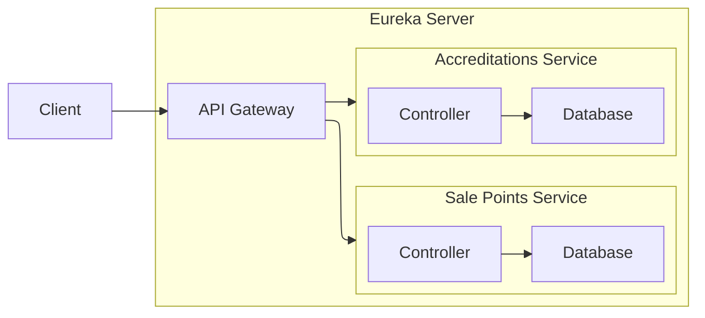
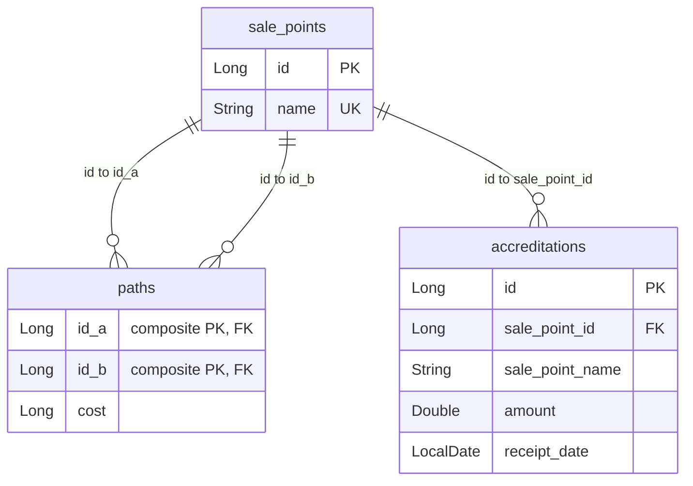
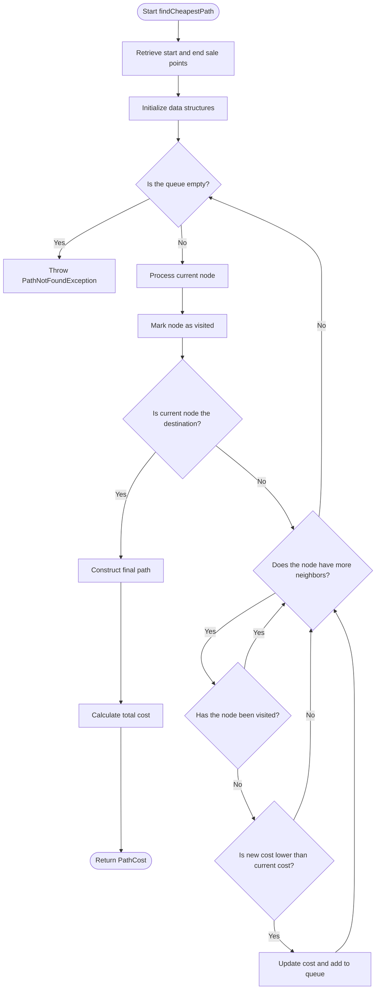

# Java Challenge 2025

A microservices-based Java project for managing sale points and accreditations, featuring service discovery, API gateway, and PostgreSQL databases. This project demonstrates modern Java backend development practices, containerization, and microservices orchestration.

## Technologies Used

- **Java 21**
- **Maven**
- **Spring Boot** (Data JPA, Web, etc.)
- **Spring Cloud Netflix Eureka**
- **Spring Cloud Gateway**
- **Lombok**
- **PostgreSQL**
- **Podman & Podman Compose**

## Project Architecture

This project follows a microservices architecture, with the following main components:

- **Eureka Server**: Service registry for microservices.
- **API Gateway**: Entry point for all client requests, routing to appropriate services.
- **Sale Points Service**: Manages sale points data and logic.
- **Accreditations Service**: Handles accreditations data and logic.
- **PostgreSQL Databases**: Each service has its own isolated database.



## Database Relationships

Each service has its own PostgreSQL database. The main entities and relationships are as follows:

- Sale Points Service:
  - `sale_points`: Represents sale points with unique names.
  - `paths`: Represents direct paths between sale points with associated costs.
- Accreditations Service:
  - `accreditations`: Represents accreditations linked to sale points, including amounts and receipt dates.



## Dijkstra Algorithm Flowchart

The project implements the Dijkstra algorithm for cheapest path calculation, which is used in endpoint `/api/paths/{idA}/{idB}/cost` (details in the sale points service).



## Setup Instructions

### Prerequisites

- [Docker](https://www.docker.com/products/docker-desktop) and Docker Compose installed ([Podman](https://podman-desktop.io/) can be used as an alternative)
- Java 21 and Maven (for local development, optional)

### 1. Clone the Repository

```sh
git clone --recurse-submodules https://github.com/nekusu/java-challenge-2025.git
cd java-challenge-2025
```

### 2. Create Environment Files

For both sale-points-service and accreditations-service, create a `.env` file using the provided `.env.example` as a template:

```sh
cp sale-points-service/.env.example sale-points-service/.env
cp accreditations-service/.env.example accreditations-service/.env
```

Edit the `.env` files as needed for your environment (database credentials).

### 3. Build and Run with Docker Compose

```sh
docker compose up
```

or, if using Podman:
```sh
podman compose up
```

This will start all services:
- Eureka Server ([`http://localhost:8761`](http://localhost:8761))
- API Gateway ([`http://localhost:8080`](http://localhost:8080))
- Sale Points Service ([`http://localhost:8090`](http://localhost:8090))
- Accreditations Service ([`http://localhost:8091`](http://localhost:8091))
- PostgreSQL databases:
  - Sale Points Database ([`http://localhost:5432`](http://localhost:5432))
  - Accreditations Database ([`http://localhost:5433`](http://localhost:5433))
