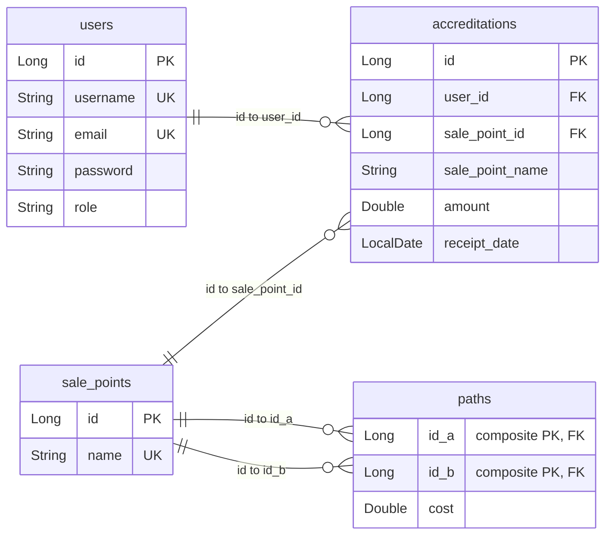
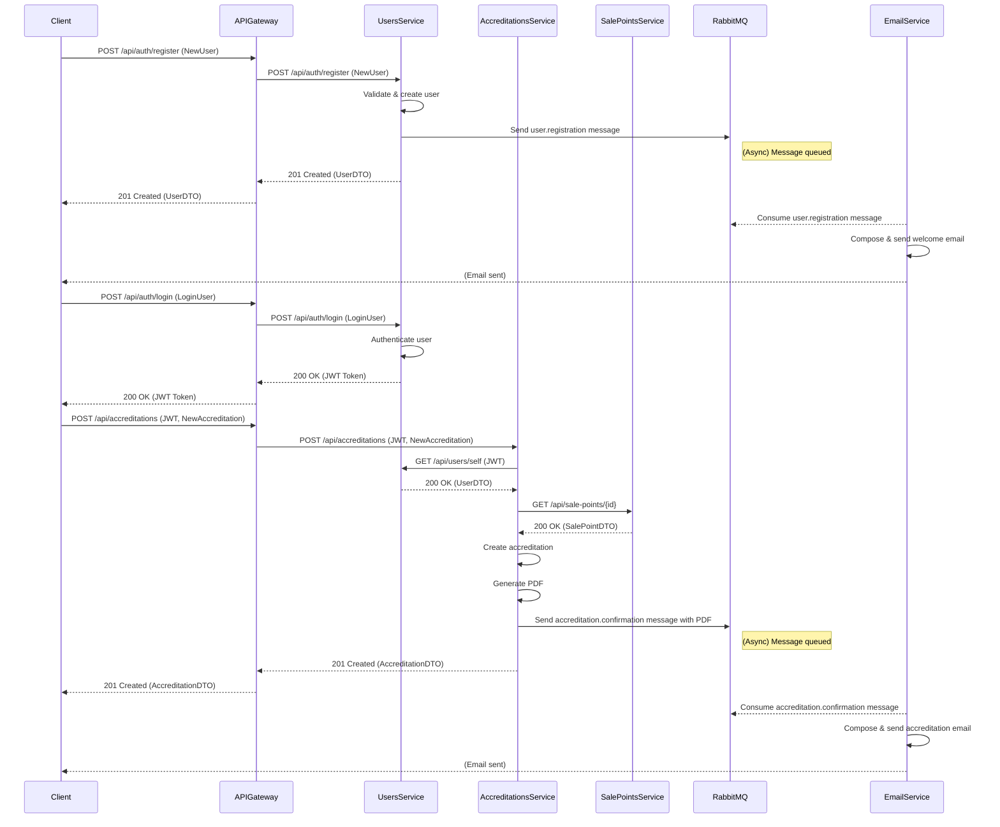
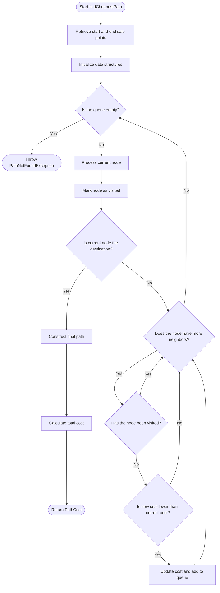

# Java Challenge 2025

A microservices-based Java project for managing sale points and accreditations, featuring service discovery, API gateway, and PostgreSQL databases. This project demonstrates modern Java backend development practices, containerization, and microservices orchestration.

## Technologies Used

- **Java 21**
- **Maven**
- **Spring Boot** (Data JPA, Web, Validation, Cache, DevTools)
- **Spring Cloud Netflix Eureka**
- **Spring Cloud Gateway**
- **Spring Security** (with Java JWT)
- **SpringDoc OpenAPI** (with Swagger UI)
- **JUnit**
- **Mockito**
- **Lombok**
- **PostgreSQL**
- **RabbitMQ**
- **Java Mail**
- **OpenPDF**
- **Podman & Podman Compose**

## Project Architecture

This project follows a microservices architecture, with the following main components:

- **Eureka Server**: Service registry for microservices.
- **API Gateway**: Entry point for all client requests, routing to appropriate services.
- **RabbitMQ**: Message broker for asynchronous communication between services.
- **Users Service**: Manages user authentication and authorization, including JWT token generation and validation.
- **Accreditations Service**: Handles accreditations data and logic.
- **Sale Points Service**: Manages sale points data and logic.
- **Email Service**: Sends emails asynchronously using RabbitMQ.
- **PostgreSQL Databases**: Each service has its own isolated database.

[](https://mermaid.live/edit#pako:eNqdVU2P2jAQ_SvWHKqtRBBk2WzIoRLtVlUPK9Fue-l6DyYxYBFs5DjdUsR_79ghCeZrUXOaGb_5eJ5nZQOpyjgkEAQBlamSUzFLqCQkZ2tVmoTwfEGlO5zm6jWdM23Ij4-IKMrJTLPVnPwsuC6euP4tUv5Mwblk51N4scUIyYTmqRFKVsm7b1Sa-ScljVZ5zvUNBRsgbYTC-xZsC3tgG7gELh6YYRNW8GcE1zaiXg5gY62yMnUla3NXi8tsn-koTTXPhGGWyB5lP34tdy_JI3aGk5_xNjkffzXLJ5bzsRLS7DG0MVIFr6TXVPGYtXXOLW7MDiRhA-fA7aiXbuOA3-clE3lLzblXknJYnKUol_WinOldpMWVmi-Yrcm1beFcUvnYggTBBzJaiS_M8Fe2tgoafyU7z56_8x4VuieVh_GjXWFsn181jv9yXHfvfVQo_zEeo-qpGvXISzKuOJ5U7BEfv-IJ5bhix8uu8L5iLkK9-R3yO5tMhHn8hjuozUYDp4f00ipg7bkjTyO7Qs2q21v9j91SCR2YaZFBYnTJO4ANsBm6sLGNKJg5X6KGEzQzphcUqNxizorJX0ot6zStytkckinLC_TKVYazPQiGr2PZRDVq2YqmlAaS_q2rAckG_qAXxt24P4iGg_59eBvH_agDa0gGUTccDIdhFOJJ2LvrRdsO_HVte934_q639_U7YBkr_Vj9fNw_aPsP-ioxyw)

_Click the image to view the diagram code (not included in the README because [GitHub does not support elk layout rendering](https://github.com/orgs/community/discussions/138426))._

## Database Relationships

Each service has its own PostgreSQL database. The main entities and relationships are as follows:

- Users Service:
  - `users`: Represents users with unique usernames and emails.
- Accreditations Service:
  - `accreditations`: Represents accreditations linked to users and sale points, including amounts and receipt dates.
- Sale Points Service:
  - `sale_points`: Represents sale points with unique names.
  - `paths`: Represents direct paths between sale points with associated costs.



## Application Workflow

The following sequence diagram illustrates the end-to-end flow of key user actions in the system: registration, login, and accreditation creation. It shows how the client interacts with the API Gateway, which routes requests to the appropriate microservices.

Asynchronous messaging is used for sending emails, so the main application flow is not blocked while notifications are delivered.



## Dijkstra Algorithm Flowchart

The project implements the Dijkstra algorithm for cheapest path calculation, which is used in endpoint `/api/paths/{idA}/{idB}/cost` (details in the sale points service).



## Setup Instructions

### Prerequisites

- [Docker](https://www.docker.com/products/docker-desktop) and Docker Compose installed ([Podman](https://podman-desktop.io/) can be used as an alternative)
- Java 21 and Maven (for local development, optional)

### 1. Clone the Repository

```sh
git clone --recurse-submodules https://github.com/nekusu/java-challenge-2025.git
cd java-challenge-2025
```

### 2. Create Environment Files

You need to create environment files for each service and for the root of the project:

- For `users-service`, `accreditations-service`, and `sale-points-service`, create a `.env` file from the provided `.env.example` template:

    ```sh
    cp users-service/.env.example users-service/.env
    cp accreditations-service/.env.example accreditations-service/.env
    cp sale-points-service/.env.example sale-points-service/.env
    ```

- At the root of the project, also create a `.env` file from the root `.env.example`:

    ```sh
    cp .env.example .env
    ```

Edit the `.env` files as needed for your environment (e.g., database credentials).

**Important:**  
In the root `.env` file, set the `JWT_SECRET` variable to a secure, random base64-encoded string that is at least 256 bits (32 bytes) long. For example, you can generate one using:

```sh
openssl rand -base64 32
```

Replace the value of `JWT_SECRET` in `.env` with the generated string.

### 3. Build and Run with Docker Compose

```sh
docker compose up
```

or, if using Podman:
```sh
podman compose up
```

This will start the services:
- API Gateway ([`http://localhost:8080`](http://localhost:8080))
- RabbitMQ Management Console ([`http://localhost:15672`](http://localhost:15672))
  - Username: `user`
  - Password: `password`
- PostgreSQL databases:
  - Users Database ([`http://localhost:5434`](http://localhost:5434))
  - Accreditations Database ([`http://localhost:5433`](http://localhost:5433))
  - Sale Points Database ([`http://localhost:5432`](http://localhost:5432))

## Working with the API

You can try the endpoints of each service using their Swagger UI documentation or by importing their OpenAPI definitions into API tools like [Postman](https://www.postman.com/) or [Hoppscotch](https://hoppscotch.com/).

### Swagger UI

Once all services are running, you can access the main Swagger UI at:

- [`http://localhost:8080/swagger-ui.html`](http://localhost:8080/swagger-ui.html)

From this page, you can navigate to the Swagger documentation for each service (Users, Accreditations, and Sale Points) through the provided dropdown or links. This allows you to explore and try out all available endpoints directly from your browser.

### Importing OpenAPI Specs

Each service exposes its OpenAPI specification at the following URLs:

- **Users Service:** [`http://localhost:8080/users/v3/api-docs`](http://localhost:8080/users/v3/api-docs)
- **Accreditations Service:** [`http://localhost:8080/accreditations/v3/api-docs`](http://localhost:8080/accreditations/v3/api-docs)
- **Sale Points Service:** [`http://localhost:8080/sale-points/v3/api-docs`](http://localhost:8080/sale-points/v3/api-docs)

To import into **Hoppscotch**:

1. Go to [Hoppscotch.io](https://hoppscotch.io/).
3. In the Collections section, click **Import** > **Import from OpenAPI** > **Import from URL**.
4. Paste the OpenAPI URL and import.

### Authentication

Most endpoints require authentication using a JWT Bearer token.

- You can obtain a token by registering and logging in via the `/api/auth/register` and `/api/auth/login` endpoints (see Users Service).
- Use the token in the `Authorization` header as `Bearer <token>` when making requests.

**Default Admin User:**  
A default admin user is created automatically when the Users Service starts:

- **Username:** `admin`
- **Email:** `admin@email.com`
- **Password:** `admin`

You can use these credentials to log in and obtain an admin JWT token for testing protected endpoints.
